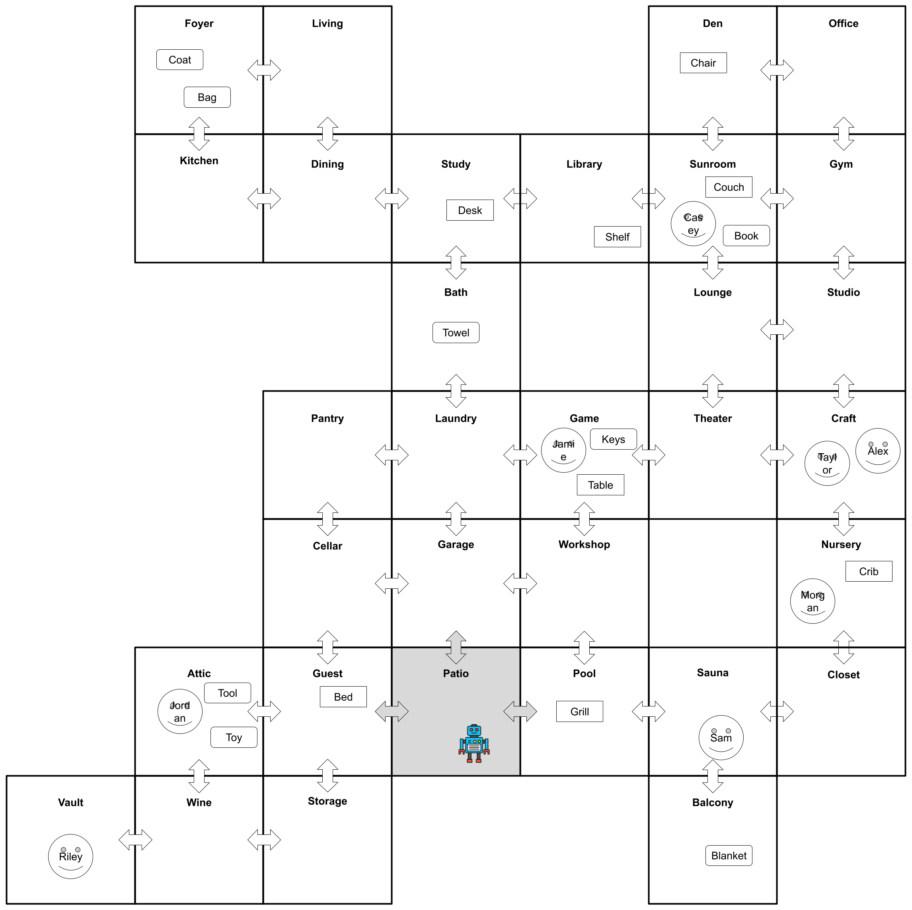
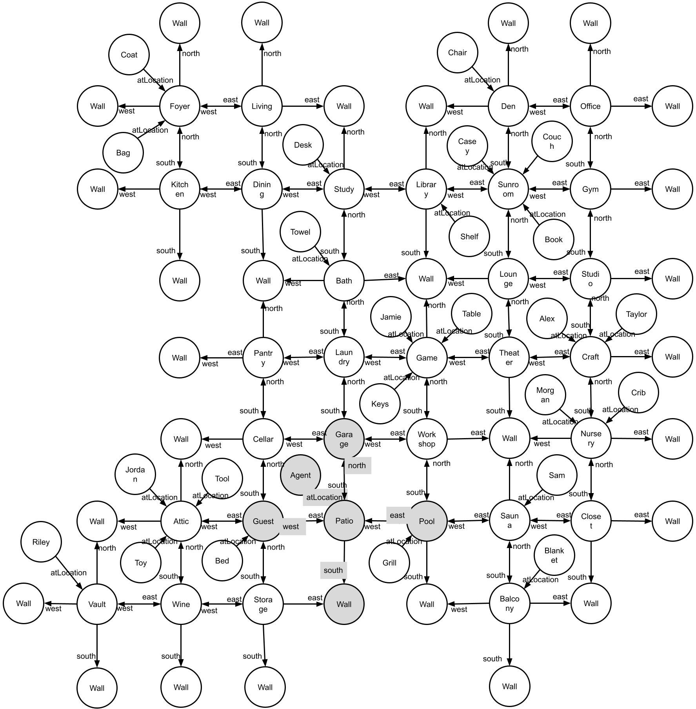
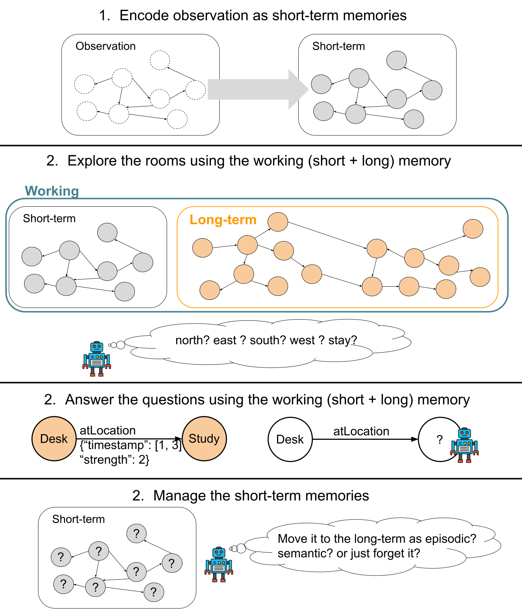
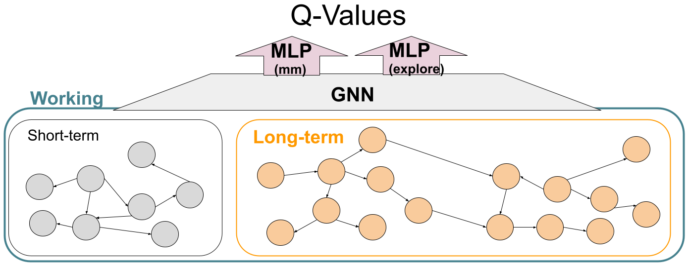
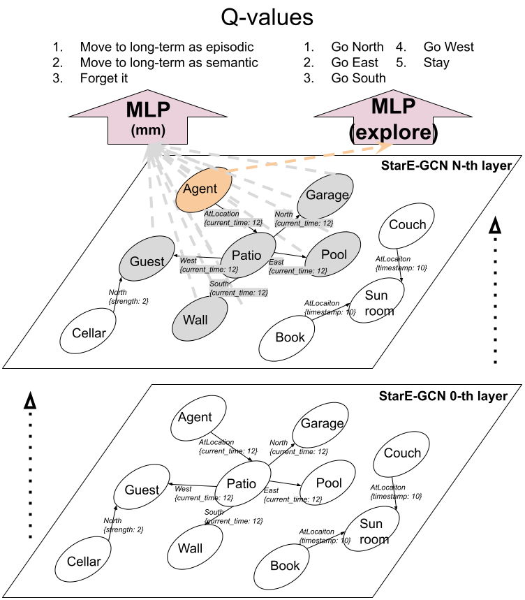
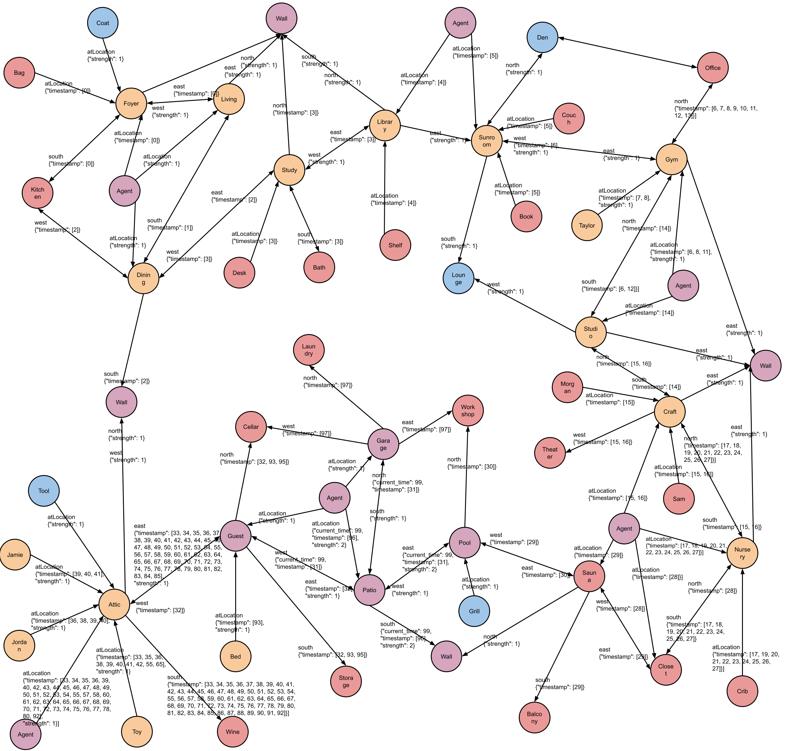

# Agent for RoomEnv-v2

[](https://zenodo.org/doi/10.5281/zenodo.10876430)
[]()

- This repo trains an agent with a GNN that interacts with the [RoomEnv-v2](https://github.com/humemai/room-env)
- The HumemAI-Unified agent is an upgrade from [HumemAI](https://github.com/humemai/agent-room-env-v2-lstm)

## Prerequisites

1. A unix or unix-like x86 machine
1. python 3.10 or higher.
1. Running in a virtual environment (e.g., conda, virtualenv, etc.) is highly
   recommended so that you don't mess up with the system python.
1. Install the requirements by running `pip install -r requirements.txt`

## Jupyter Notebooks

- [Training our agent (and their hyperparameters)](train-dqn.ipynb)
- [Running trained models](run-trained-models.ipynb)

## RoomEnv-v2

| An illustration of a hidden state $s_{t}$ (in white) and partial observation $o_{t}$ (in gray). |
| :---------------------------------------------------------------------------------------------: |
|                                                            |

| A hidden state $s_{t}$ (in white) and partial observation $o_{t}$ (in gray) represented as a KG. |
| :----------------------------------------------------------------------------------------------: |
|                                                          |

## HumemAI-Unified Agent

| A visualization depicting the two steps in training. |
| :--------------------------------------------------: |
|                          |

|              DQN of HumemAI              |
| :--------------------------------------: |
|  |

|         DQN of HumemAI-Unified          |
| :-------------------------------------: |
|  |

| A forward-pass example of $\text{StarE-GCN}$, $\text{MLP}^{\text{mm}}$, and $\text{MLP}^{\text{explore}}$ |
| :-------------------------------------------------------------------------------------------------------: |
|                                                                      |

| An example of the agent's (HumemAI-Unified with $capacity=192$) memory $\bm{M}_{t=99}$. |
| :-------------------------------------------------------------------------------------: |
|                                         |

## Training Results

| Capacity | Agent Type          | Phase 1   | Phase 2       |
| -------- | ------------------- | --------- | ------------- |
| 12       | HumemAI-Unified     | N/A       | 152 (±7)      |
|          | **HumemAI**         | 105 (±37) | **160 (±30)** |
|          | Baseline            | N/A       | 144 (±14)     |
| 24       | **HumemAI-Unified** | N/A       | **233 (±34)** |
|          | HumemAI             | 127 (±26) | 214 (±64)     |
|          | Baseline            | N/A       | 138 (±52)     |
| 48       | **HumemAI-Unified** | N/A       | **341 (±21)** |
|          | HumemAI             | 118 (±18) | 235 (±37)     |
|          | Baseline            | N/A       | 200 (±15)     |
| 96       | **HumemAI-Unified** | N/A       | **466 (±37)** |
|          | HumemAI             | 217 (±27) | 209 (±87)     |
|          | Baseline            | N/A       | 155 (±77)     |
| 192      | **HumemAI-Unified** | N/A       | **482 (±14)** |
|          | HumemAI             | 265 (±22) | 176 (±115)    |
|          | Baseline            | N/A       | 144 (±68)     |

## pdoc documentation

Click on [this link](https://humemai.github.io/agent-room-env-v2-gnn) to see the HTML
rendered docstrings

## Contributing

Contributions are what make the open source community such an amazing place to be learn,
inspire, and create. Any contributions you make are **greatly appreciated**.

1. Fork the Project
1. Create your Feature Branch (`git checkout -b feature/AmazingFeature`)
1. Run `make test && make style && make quality` in the root repo directory, to ensure
   code quality.
1. Commit your Changes (`git commit -m 'Add some AmazingFeature'`)
1. Push to the Branch (`git push origin feature/AmazingFeature`)
1. Open a Pull Request

## [Cite our paper]()

```bibtex

```

## Authors

- [Taewoon Kim](https://taewoon.kim/)
- [Michael Cochez](https://www.cochez.nl/)
- [Vincent Francois-Lavet](http://vincent.francois-l.be/)
